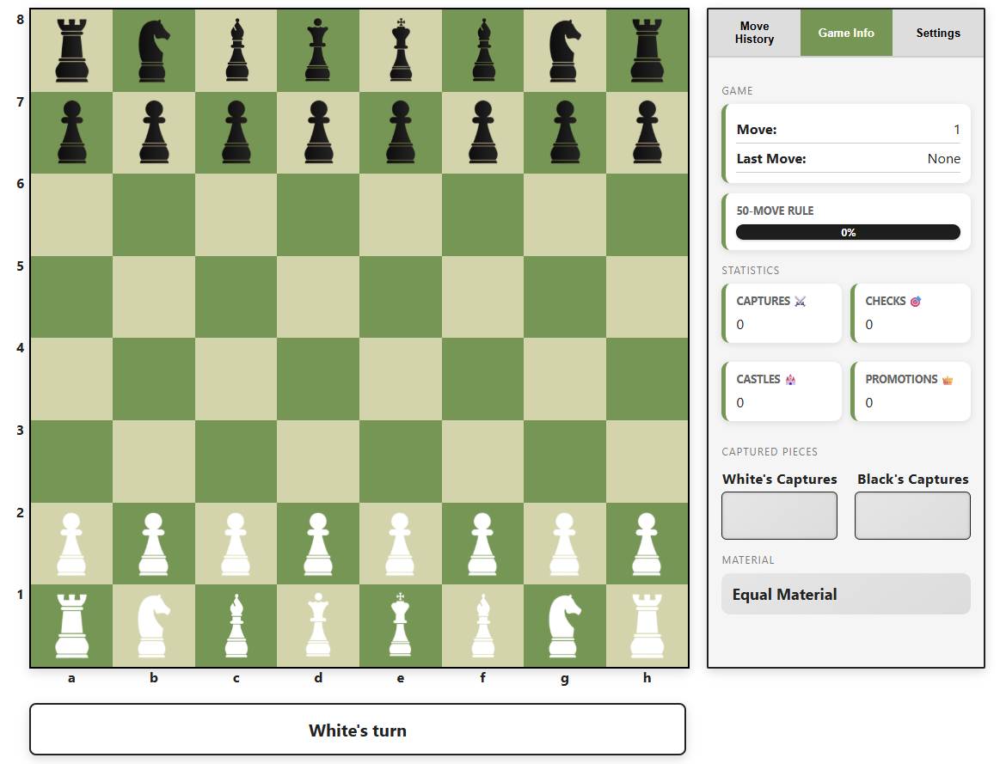

# ♟️ Chess Studio 

This project is a browser-based Chess Game developed using **HTML**, **CSS**, and **JavaScript**. It supports both **Two Player** mode and **Player vs Computer** mode while implementing the official rules of chess. The application also includes an interactive learning guide, customizable settings, game statistics, and responsive design for desktop and mobile devices.

<p align="center">  </p>

## Features

| Category | Description |
|----------|-------------|
| **Game Features** | Play against another player or the computer with move history, statistics, captured pieces, audio effects, and a responsive interface. |
| **Chess Rules** | Implements standard chess rules, including castling, en passant, promotion, checkmate, stalemate, threefold repetition, the fifty-move rule, and insufficient material detection. |
| **Learning Guide** | Learn chess through interactive piece guides, movement demonstrations, special move examples, strategy lessons, and tactical puzzles. |
| **Customization** | Personalize the experience with themes, dark mode, board flipping, coordinate labels, move hints, highlights, volume controls, and saved preferences. |


## Technologies Used
- HTML
- CSS
- JavaScript
- Local Storage API


## Project Structure

```

├── home.html                     # Landing page and main menu
├── guide.html                    # Interactive chess learning guide
├── chess.html                    # Main chess game interface
├── css/
│   └── style.css                 # All styling (theme colors in :root at the top)
├── js/
│   ├── chess-set.js              # Board setup, piece data, and game initialization
│   ├── game.js                   # Game logic, move handling, UI, and computer opponent
│   ├── guide.js                  # Learning guide and interactive demonstrations
│   ├── home.js                   # Home page functionality and menu navigation
│   ├── rules.js                  # Chess rules, move validation, and game state checks
│   └── settings.js               # Settings management and local storage
│   
├── img/
│   ├── white-*.png               # White chess piece images
│   ├── black-*.png               # Black chess piece images
│   └── icons/
│
└──── audio/                      # Game audio
    ├── move.mp3
    ├── capture.mp3
    ├── castle.mp3
    ├── check.mp3
    ├── promote.mp3
    └── gameover.mp3
     
```


## Usage

### How to Run
1. Download or clone the repository.
```

git clone https://github.com/dongantony/chess-studio.git

```
2. Open the project folder.
3. Launch **home.html** in any modern web browser.

No additional software or installation is required.

---

### How to Play
1. Select **Play Game**.
2. Choose either:
    - Two Player
    - Computer
3. If Computer mode is selected, choose the difficulty.
4. Click a piece to display its legal moves.
5. Click one of the highlighted squares to move the piece.
6. Continue until checkmate, stalemate, or another draw condition is reached.


## Future Improvements

Planned enhancements for future versions of the project include:

- **Stronger AI Opponents** – Implement Medium and Hard difficulty levels using the Minimax algorithm with alpha-beta pruning.
- **Chess Clocks** – Add configurable timers for timed games.
- **Opening Database** – Provide opening recognition and suggested opening names.
- **Drag-and-Drop Movement** – Support moving pieces by dragging instead of clicking.
- **FEN Import/Export** – Allow games to be loaded from and saved as Forsyth–Edwards Notation (FEN).
- **PGN Export** – Enable completed games to be exported in Portable Game Notation (PGN).

---

*Chess Studio v1 | Antony Dong*